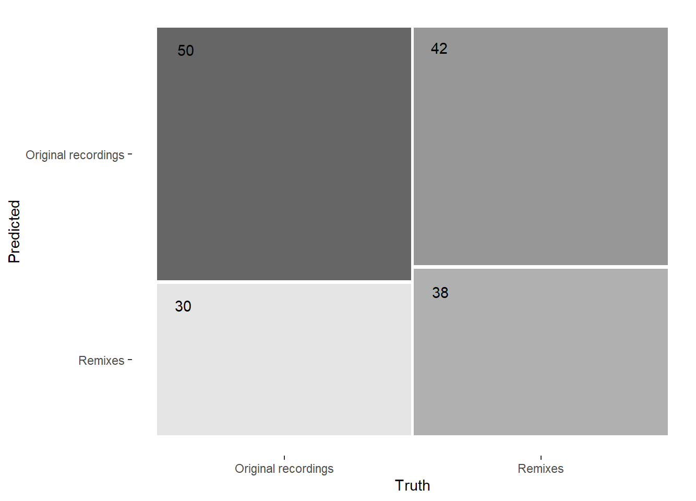
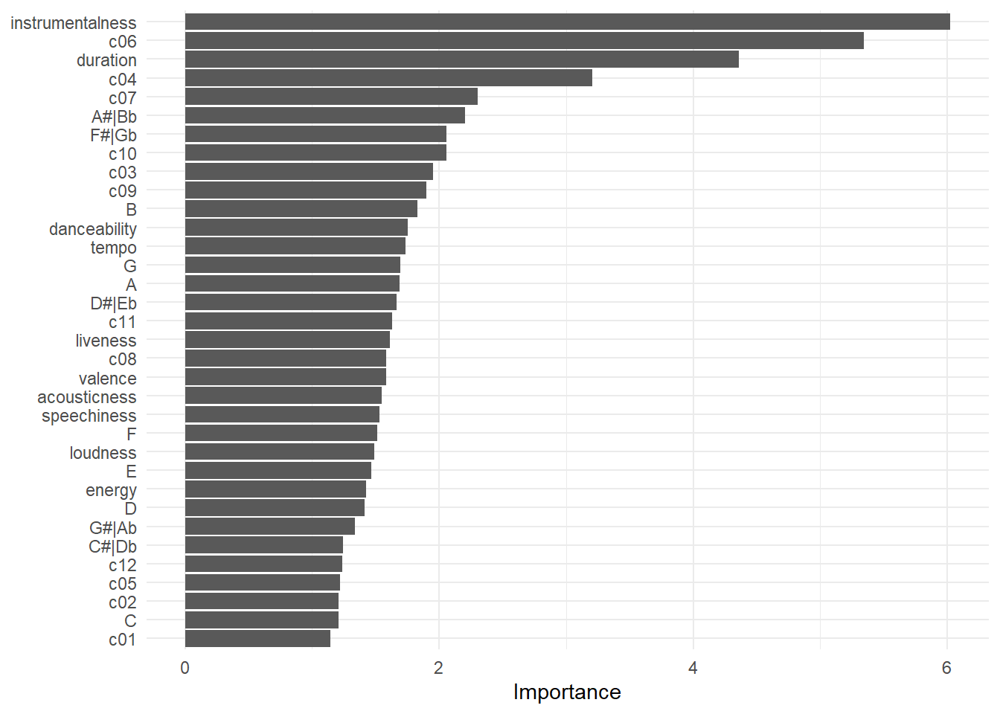

<style>
body {
font-family: "Open Sans","Helvetica Neue",Helvetica,Arial,sans-serif;
}


    .sbframe-commentary {
    width: 21vw;
    min-width: 350px;
    font-size: 15px;
}

.navbar-inverse {
  background-color: #87CEEB;
}

.storyboard-nav .sbframelist ul li.active {
background-image: url(wave.png);
background-color: #87CEEB;
}

.storyboard-nav .sbframelist ul li {
background-image: url(wave.png);
}


caption {
color: #2c3e50;
font-weight: bold;
}

</style>

```{r libraries}
library(spotifyr)
library(tidyverse)
library(expss)
library(knitr)
library(stringr)
library(forcats)
library(plotly)
library(compmus)
library(gridExtra)
library(cowplot)
library(stringr)
library(DT)
```


```{r playlist information}
originals <- get_playlist_audio_features("", "67znZtLJIfAIdEOgxnRgCL")
originals <- originals[-c(10,66,68,71),] # remove duplicates of duplicates due to some Spotify API quirk
row.names(originals) <- NULL # reassign row-numbers
remixes <- get_playlist_audio_features("", "0f4kAOBTCO8aEh1nrITYQL")

remixes <- remixes %>% mutate(id = row_number(), remix_name = track.name)
originals <- originals %>% mutate(id = row_number(), remix_name = remixes$remix_name)
```

```{r combine}
tracks <-
  bind_rows(
    originals %>% mutate(category = "Original recordings", artists_string = str_replace_all(sapply(track.artists, function(x) x[3]), '(c\\()*(["\\)])*', "")),
    remixes %>% mutate(category = "Remixes", artists_string = str_replace_all(sapply(track.artists, function(x) x[3]), '(c\\()*(["\\)])*', ""))
  )
```

### **Introduction**: It's the remix!

At the beginning of the Computational Musicology course, we were asked to choose a corpus for the portfolio. A key aspect of the corpus selection was to come up with a selection that allowed for meaningful comparisons and contrasts, to answer a specific research question. Since the ideal corpus size was around 50-100 tracks, I immediately thought of my playlist with around 80 remixes, that I started maintaining during the first COVID-19 lockdown in The Netherlands.

I started maintaining this playlist for myself because there are generally a large number of remixes for artists that I follow, but I was unfamiliar with most.
Remixes are often an underappreciated part of an artist's discography. Most often, the reason a remix is made is to adapt or revise a song for radio or nightclub play, as is stated beautifully, among other reasons, on [Wikipedia](https://en.wikipedia.org/wiki/Remix).
The remixes on my playlist are either extended remixes by the original artists/producers or a remix that has a significant amount of production on the song altered from the original. Remixes, where the only difference is a new guest artist are common nowadays but **not** included on the playlist. Listening to a lot of remixes and collecting those that I like was an interesting musical journey. Before diving deep down the "Singles and EPs" section of a lot of artists' Spotify profiles, I allowed myself to be influenced by various threads in the [popheads](https://www.reddit.com/r/popheads/search/?q=discussion%20remix&restrict_sr=1) subreddit. 

I will try to answer one main research question in this portfolio: What makes the remixes in my playlist different from their original recordings?

First, I take a look at the track-level Spotify features for both groups, then I dive a bit deeper with a few lower-level track analyses. For example, an expected change is the tempo of a remix, which is probably higher than the original tracks. Finally, I try to see if a remix can easily be detected by a classifier, based on this corpus.

**Typical tracks**:

1. Katy Perry - Chained To The Rhythm (Oliver Heldens Remix)
    * This is quite a typical dance remix of a pop spng, as there are lots on Spotify. Producers like Oliver Heldens and R3HAB just love to put these out. This is the type of remix that does no harm but also doesn't bring a lot (different) to the table.
2. Lady Gaga & Ariana Grande - Rain On Me (Purple Disco Machine Remix)
    * This is an extended version of the original, but the beat is a bit more house. There are more extended versions/remixes of tracks on this playlist, so it's quite typical.

**Atypical tracks**:

1. NAO - In The Morning - Mura Masa Edit
    * Instead of making this track more energetic, this remix swaps the beat and keeps it low-key, with a very present filter applied to NAO's vocals.
2. Kesha - Praying (Frank Walker Remix)
    * This turns an acclaimed ballad into a dancefloor banger, with a good drop and build-ups. It may sound typical, but it feels so different and flips across genres.


***    
    
```{=html}
<object data="https://open.spotify.com/embed/playlist/67znZtLJIfAIdEOgxnRgCL" width="100%" height="49%">
    <embed src="https://open.spotify.com/embed/playlist/67znZtLJIfAIdEOgxnRgCL" width="100%" height="49%"></embed>
</object>
<object data="https://open.spotify.com/embed/playlist/0f4kAOBTCO8aEh1nrITYQL" width="100%" height="49%">
    <embed src="https://open.spotify.com/embed/playlist/67znZtLJIfAIdEOgxnRgCL" width="100%" height="49%"></embed>
</object>
```
    
### A remix can change a lot of aspects of a song, an expected change is the **tempo**

```{r plot1}
tracks %>%
  ggplot(aes(x= category, y = tempo)) +
  geom_violin(fill="skyblue") +
  geom_text(                  # Add outlier labels
    aes(
      y = tempo,
      label = label
    ),
    data = 
      tibble(
        label = c("Slow Down", "Need Ur Luv -\nJapanese Wallpaper\nRemix"),
        category = c("Original recordings", "Remixes"),
        tempo = c(203.579,215.997)
      ),
    colour = "black",         # Override colour.
    size = 3,                 # Override size.
    hjust = "left",           # Align left side of label with the point.
    vjust = "middle",         # Align middle of label with the point.
    nudge_x = 0.05,          # Nudge the label slightly right.
    nudge_y = -1            # Nudge the label slightly down.
  ) +
  scale_y_continuous(breaks=seq(80,220,by=20)) +
  labs(
    title = "Distribution of tempo in original and remixed recordings",
    y = "Tempo (BPM)",
    x = element_blank()
  ) +
  theme_minimal() + theme(plot.title = element_text(hjust = 0.5), legend.position = "none")
```

***
Since remixes exist for a large number of reasons, and since one of the main reasons is making a song more suitable for the dancefloor, there is probably some change in tempo. One of the many features the [Spotify API](https://developer.spotify.com/documentation/web-api/reference/#object-audiofeaturesobject) provides is the average tempo across a track.

In the violin plot, which shows the full tempo distribution for both categories, it's apparent that for original recordings, the tempo for most tracks lies between 100-140 bpm, with a peak around 120 bpm. The tempo distribution for the remixes is a lot denser, with a peak at just slightly above 120 bpm. Most house music, and thus, remixes that fall into that genre, is around 128 bpm nowadays, which can be a significant factor in the overall tempo change.

Tempo alone doesn't define how club-ready a track is, other important factors are energy, danceability, and loudness, all features in the Spotify API.

### Other important factors regarding remixes: **danceability**, **energy**, and **loudness**

```{r distr}
energy <- tracks %>%
  ggplot(aes(x= category, y = danceability)) +
  geom_boxplot(fill="skyblue") +
  scale_y_continuous(breaks=seq(0,1,by=0.20)) +
  labs(
   y = "Danceability",
   x = element_blank()
  ) +
  theme_minimal() +  theme(legend.position = "none", axis.text=element_text(size=7))

danceability <- tracks %>%
  ggplot(aes(x= category, y = energy)) +
  geom_boxplot(fill="skyblue") +
  scale_y_continuous(breaks=seq(0,1,by=0.20)) +
  labs(
   y = "Energy",
   x = element_blank()
  ) +
  theme_minimal() +  theme(legend.position = "none", axis.text=element_text(size=7))

loudness <- tracks %>%
  ggplot(aes(x= category, y = loudness)) +
  geom_boxplot(fill="skyblue") +
  labs(
   y = "Loudness (dB)",
   x = element_blank()
  ) +
  theme_minimal() + theme(legend.position = "none", axis.text=element_text(size=7))

grid.arrange(energy,danceability,loudness, top = "Distribution of danceability, energy and loudness", nrow=1)
```

***

When thinking of dance tracks, one thinks of high-energy, danceable tracks, and the music being played loudly. Since Spotify has all of these features computed, we can look at the distribution.

According to the Spotify API documentation, energy is measure from 0.0 to 1.0 and it "represents a perceptual measure of intensity and activity. Typically, energetic tracks feel fast, loud, and noisy", danceability is also from 0.0 to 1.0 and describes "how suitable a track is for dancing based on a combination of musical elements including tempo, rhythm stability, beat strength, and overall regularity". Loudness is the overall loudness of a track in decibels and is averaged across the entire track.

```{r}
knitr::kable(tracks %>% group_by(category) %>% summarize(mean_danceability = round(mean(danceability),3), mean_energy = round(mean(energy),3), mean_loudness = round(mean(loudness),3)), col.names = c("Category", "Danceability", "Energy", "Loudness"), caption="Means for several features, per category")
```

As visible in the boxplots and the table with means, remixes have just slightly higher energy and danceability, as one would expect. Overall, they are just a bit less loud than the original recording.


### Big changes in **energy** point towards a remix being really different from the original

```{r calculate energy differences}
absdiff <- function(x) abs(diff(c(x, 0)[1:2]))

energy_absdifference <- full_join(originals, tracks) %>%
   group_by(id) %>%
   summarise_at(c("energy"),~if(n() > 1) absdiff(.) else .)

energy_absdifference <- energy_absdifference %>%
  rename(energy_absdiff=energy)

energy_difference <- full_join(originals, tracks) %>%
   group_by(id) %>%
   summarise_at(c("energy"),~if(n() > 1) diff(.) else .)

energy_difference <- energy_difference %>%
  rename(energy_diff=energy)

duration_difference <- full_join(originals, tracks) %>%
   group_by(id) %>%
   summarise_at(c("track.duration_ms"),~if(n() > 1) diff(.)/1000 else .)

duration_difference <- duration_difference %>%
  rename(duration_diff = track.duration_ms)

tracks <- inner_join(tracks, energy_absdifference)
tracks <- inner_join(tracks, energy_difference)
tracks <- inner_join(tracks, duration_difference)
```

```{r plot 3 differences}
most_different <- tracks %>% top_n(20, energy_absdiff) %>% mutate(remix_name = fct_reorder(remix_name,
                               energy_absdiff,
                               last)) # get 10 biggest differences (remix and original have same difference value)
ggplot(most_different) + 
geom_point(aes(x=energy,y=remix_name,size=tempo), alpha=0.3, color="deepskyblue") +
geom_path(aes(x=energy,y=remix_name), 
          arrow = arrow(length = unit(1.5, "mm"), type = "closed")) +
geom_text(aes(x = energy,
              y = remix_name,
              label = sprintf("%0.2f", round(energy, digits = 2)),
              vjust=1.5),size=3) +
labs(
  title = "Top 10 remixes with biggest change in energy from the original",
  y = "",
  x = "Energy",
  size = "Tempo (BPM)"
) +
  
theme_minimal() +
theme(plot.title = element_text(hjust = 0.5)) + 
scale_y_discrete(labels = function(x) str_wrap(str_replace_all(x, "foo" , " "),
                                                 width = 25)) +
coord_cartesian(xlim = c(0, 1))
```

***

As we've seen, energy for remixes is just slightly higher on average, and the energy values are not distributed in an entirely different way. However, that doesn't mean that there can't be huge differences for an individual remix. 

After listening to some of the tracks with a big difference in Spotify-measured energy, I agreed that those were the remix where a lot of elements were changed from the original. 

Interesting enough: Flume and Disclosure both have a track of theirs remixed and a remix that they did in this top 10.

### And what about the smallest differences in energy?

```{r table least different}
least_different <- tracks %>% filter(category=="Remixes") %>% arrange(energy_absdiff)

datatable(least_different[,c("artists_string", "track.name","energy","energy_diff", "energy_absdiff", "duration_diff")], caption = "Remixes ordered by least change in energy, with duration change", colnames = c("Artist(s)", "Remix", "Energy", "Change in energy from original", "Absolute energy difference", "Change in duration (seconds)"), options = list(scrollY="100%",scrollCollapse=TRUE,paging=FALSE,
  rowCallback = JS(),
lengthChange = FALSE), callback = JS("table.order([5, 'asc']).draw();")) %>% formatRound(columns = c(3:5), digits =  3) %>% formatRound(columns = c(6), digits =  0)
```

***

After looking at the remixes with the biggest change in energy, it's interesting to look at the remixes with the smallest change as well. The top 10 "least different" really don't feel that different from the original.

Half of the songs in the top 10 are mostly remixes that are just extended versions of the original song, namely: Circus, Flames, Better When You’re Gone, Don’t Start Now, and Toxic. It makes sense that an extended version of a song is not drastically different from the original. Also of note:  Mura Masa has a track in both the top 10 biggest and top 10 smallest changes in energy.

### Emotional valance and arousal; do remixes shift the **mood** of a song?

```{r plot 2}

d <- highlight_key(tracks, ~id)

plot2 <- ggplot(d, aes(x=valence,y=energy,size=tempo,color=mode_name,label=track.name)) +
geom_point(alpha=0.7, aes(text=sprintf('Artist(s): %s<br>Track: %s<br>Valence: %s | Energy: %s<br>Mode: %s | Tempo: %s BPM', artists_string, track.name, round(valence, 2), round(energy,2), mode_name, round(tempo)))) +
geom_text(                  # Add outlier labels
    aes(
      x = valence,
      y = energy,
      label = label
    ),
    data = 
      tibble(
        label = c("Active", "Passive"),
        valence = c(0.5, 0.5),
        energy = c(0.99, 0.02)
      ),
    colour = "grey50",         # Override colour.
    size = 3,                 # Override size.
    hjust = "middle",           # Align left side of label with the point.
    vjust = "middle",         # Align middle of label with the point.
    nudge_x = 0,          # Nudge the label slightly right.
    nudge_y = 0            # Nudge the label slightly down.
)+
geom_text(                  # Add outlier labels
    aes(
      x = valence,
      y = energy,
      label = label
    ),
    data = 
      tibble(
        label = c("Nervous", "Sad", "Tired"),
        valence = c(0.01, 0.01, 0.01),
        energy = c(0.99, 0.5, 0.02)
      ),
    colour = "grey50",         # Override colour.
    size = 3,                 # Override size.
    hjust = "left",           # Align left side of label with the point.
    vjust = "middle",         # Align middle of label with the point.
    nudge_x = 0,          # Nudge the label slightly right.
    nudge_y = 0            # Nudge the label slightly down.
)+
geom_text(                  # Add outlier labels
    aes(
      x = valence,
      y = energy,
      label = label
    ),
    data = 
      tibble(
        label = c("Calm", "Happy", "Enthusiastic"),
        valence = c(0.99, 0.99, 0.99),
        energy = c(0.02, 0.5, 0.99)
      ),
    colour = "grey50",         # Override colour.
    size = 3,                 # Override size.
    hjust = "right",           # Align left side of label with the point.
    vjust = "middle",         # Align middle of label with the point.
    nudge_x = 0,          # Nudge the label slightly right.
    nudge_y = 0            # Nudge the label slightly down.
)+
facet_wrap(~category) +
scale_x_continuous(         # Fine-tune the x axis.
  limits = c(0, 1),
  breaks = c(0, 0.50, 1),   # Use grid-lines for quadrants only.
  minor_breaks = NULL       # Remove 'minor' grid-lines.
) +
scale_y_continuous(         # Fine-tune the y axis in the same way.
  limits = c(0, 1),
  breaks = c(0, 0.50, 1),
  minor_breaks = NULL
) +
labs(
  title = "Energy, valence and tempo per category",
  y = "Energy",
  x = "Valence",
  size = "Tempo (BPM)"
) +
theme_minimal() + theme(legend.position = "none", plot.title = element_text(hjust = 0.5))

ggplot2 <- ggplotly(plot2, tooltip = c("groups","text"))

ggplot2 <- ggplot2 %>% layout(dragmode='zoom')

partial_bundle(highlight( ggplot2, on = "plotly_hover", off = "plotly_doubleclick"))
```

***

This graphic shows the Spotify API-determined energy and valence for all tracks in the corpus. Most original recordings in the corpus were already quite high in both energy, with almost no tracks in the lower half of the plot.

Looking at Russell’s circumplex model of affect, almost all tracks, whether remix or original, are in the upper half, between Sad, Nervous, Active, Enthusiastic, and Happy.

Looking at the remixes, the valence seems to be going more towards the extreme values on both ends. Overall, there seems to be a slight shift to the upper-left, indicating a portion of remixes should be more nervous-feeling.

When hovering over a point in the graphic, the exact values and song title are shown. The track’s counterpart in the other category gets highlighted as well, highlights can be made undone by double-clicking on any blank space in the graphic. Every point's size stands for the tempo, and their color for their mode (minor or major).

### The *need* for a **tempo**, even when it's not always accurate

```{r needurluv}
needurluv <- get_tidy_audio_analysis("1x96SvT97nQgfdgEkUiSv9")
```

```{r tempogram, cache=TRUE}
tempo1 <- needurluv %>%
  tempogram(window_size = 8, hop_size = 1, cyclic = FALSE) %>%
  ggplot(aes(x = time, y = bpm, fill = power)) +
  geom_raster() +
  scale_fill_viridis_c(guide = "none") +
  labs(x = "Time (s)", y = "Tempo (BPM)", title="Tempogram for Need Ur Luv - Japanese Wallpaper Remix") +
  scale_y_continuous(breaks=c(0,108,162,216,324,486),labels=c(0,108,162,216,324,486)) +
  theme_minimal() + theme(plot.title = element_text(hjust = 0.5))
```

```{r tempogram 2, cache = TRUE}
tempo2 <- needurluv %>%
  tempogram(window_size = 8, hop_size = 1, cyclic = TRUE) %>%
  ggplot(aes(x = time, y = bpm, fill = power)) +
  geom_raster() +
  scale_fill_viridis_c(guide = "none") +
  labs(x = "Time (s)", y = "Tempo (BPM)", title="Cycled tempogram") +
  scale_y_continuous(breaks=c(80,100,108,120,140,160),labels=c(80,100,108,120,140,160)) +
  theme_minimal() + theme(plot.title = element_text(hjust = 0.5))
```

```{r print tempogram}
grid.arrange(tempo1, tempo2, ncol=1)
```

***

```{=html}
<object data="https://open.spotify.com/embed/track/1x96SvT97nQgfdgEkUiSv9" width="100%" height="80">
    <embed src="https://open.spotify.com/embed/track/1x96SvT97nQgfdgEkUiSv9" width="100%" height="80"></embed>
</object>
```

In 2014, British pop artist Charli XCX released her sophomore album, _SUCKER_. The song "Need Ur Luv" features on the record, and has a similar vibe to BØRNS' song "Electric Love", which came out just a month before. Australian indie-pop artist Japanese Wallpaper made a remix of "Need Ur Luv", which got an official release in 2018. 

_A snippet of Charli XCX - Need Ur Luv (Japanese Wallpaper Remix)_

According to Spotify, the tempo of the remix is 216 beats per minute, which should make it quite a fast piece. As seen in the first tempogram, the different sections of the track lead to different strengths of _tempo octaves_, multiples of the tempo. The parts with stronger percussion are stronger at 108 beats per minute, but it seems like the chimes threw off Spotify's algorithm to pick to tempo for the whole piece. In the second tempogram, all tempi are cycled to be between the most common range of 80-160 beats per minute, resulting in a very clear line at around 108 beats per minute. It's not unfair to assume that the decision for the overall tempo of the piece also influences other metrics, like energy and danceability, which might be "inaccurate" for some pieces, even though only Spotify really knows how those are computed exactly.

### _Gonna be you, and me / It's gonna be everything_, **restructured** by Flume

```{r ssm info, cache=TRUE}

original <-
  get_tidy_audio_analysis("55jxzrIhEupVy1l6RDJaO5") %>% # Change URI.
  compmus_align(bars, segments) %>%                     # Change `bars`
  select(bars) %>%                                      #   in all three
  unnest(bars) %>%                                      #   of these lines.
  mutate(
    pitches =
      map(segments,
        compmus_summarise, pitches,
        method = "mean", norm = "manhattan"              # Change summary & norm.
      )
  ) %>%
  mutate(
    timbre =
      map(segments,
        compmus_summarise, timbre,
        method = "mean"              # Change summary & norm.
      )
  )

remix <-
  get_tidy_audio_analysis("3W2ZcrRsInZbjWylOi6KhZ") %>% # Change URI.
  compmus_align(bars, segments) %>%                     # Change `bars`
  select(bars) %>%                                      #   in all three
  unnest(bars) %>%                                      #   of these lines.
  mutate(
    pitches =
      map(segments,
        compmus_summarise, pitches,
        method = "rms", norm = "euclidean"              # Change summary & norm.
      )
  ) %>%
  mutate(
    timbre =
      map(segments,
        compmus_summarise, timbre,
        method = "rms", norm = "euclidean"              # Change summary & norm.
      )
  )
```


```{r ssm plots}
op <- original %>%
  compmus_self_similarity(pitches, "manhattan") %>% 
  ggplot(
    aes(
      x = xstart + xduration / 2,
      width = xduration,
      y = ystart + yduration / 2,
      height = yduration,
      fill = d
    )
  ) +
  geom_tile() +
  coord_fixed() +
  scale_x_continuous(breaks = seq(0, 266.424, by = 60)) +
  scale_y_continuous(breaks = seq(0, 266.424, by = 60)) +
  scale_fill_viridis_c(guide = "none") +
  theme_minimal() +
  labs(x = "", y = "")
  
ot <- original %>%
  compmus_self_similarity(timbre, "euclidean") %>% 
  ggplot(
    aes(
      x = xstart + xduration / 2,
      width = xduration,
      y = ystart + yduration / 2,
      height = yduration,
      fill = d
    )
  ) +
  geom_tile() +
  coord_fixed() +
  scale_x_continuous(breaks = seq(0, 266.424, by = 60)) +
  scale_y_continuous(breaks = seq(0, 266.424, by = 60)) +
  scale_fill_viridis_c(guide = "none") +
  theme_minimal() +
  labs(x = "", y = "")


rp <- remix %>%
  compmus_self_similarity(pitches, "cosine") %>% 
  ggplot(
    aes(
      x = xstart + xduration / 2,
      width = xduration,
      y = ystart + yduration / 2,
      height = yduration,
      fill = d
    )
  ) +
  geom_tile() +
  coord_fixed() +
  scale_x_continuous(breaks = seq(0, 282.581, by = 60)) +
  scale_y_continuous(breaks = seq(0, 282.812, by = 60)) +
  scale_fill_viridis_c(guide = "none") +
  theme_minimal() +
  labs(x = "", y = "")

rt <- remix %>%
  compmus_self_similarity(timbre, "cosine") %>% 
  ggplot(
    aes(
      x = xstart + xduration / 2,
      width = xduration,
      y = ystart + yduration / 2,
      height = yduration,
      fill = d
    )
  ) +
  geom_tile() +
  coord_fixed() +
  scale_x_continuous(breaks = seq(0, 282.812, by = 60)) +
  scale_y_continuous(breaks = seq(0, 282.812, by = 60)) +
  scale_fill_viridis_c(guide = "none") +
  theme_minimal() +
  labs(x = "", y = "")
```

```{r ssm grid}
grid.arrange (arrangeGrob(op, top=grid::textGrob("Original", hjust = 0.15), left="Chroma"),arrangeGrob(rp,top=grid::textGrob("Flume Remix", hjust = 0.21)),arrangeGrob(ot, left="Timbre"),rt,ncol=2, nrow=2, widths = c(2.2,2) ,heights = c(2.2,2), top=grid::textGrob("Self-similarity matrices, segmented by bars, with axes in seconds", hjust= 0.42))

```

***

```{=html}
<object data="https://open.spotify.com/embed/track/55jxzrIhEupVy1l6RDJaO5" width="100%" height="80">
    <embed src="https://open.spotify.com/embed/track/55jxzrIhEupVy1l6RDJaO5" width="100%" height="80"></embed>
</object>
<object data="https://open.spotify.com/embed/track/3W2ZcrRsInZbjWylOi6KhZ" width="100%" height="80">
    <embed src="https://open.spotify.com/embed/track/3W2ZcrRsInZbjWylOi6KhZ" width="100%" height="80"></embed>
</object>
```

Flume's remix of Disclosure's "You & Me" (featuring Eliza Doolittle) had the biggest change in energy in the corpus compared to its original recording. It's also way more popular than the original. As of writing, the remix has 398 million Spotify streams, while the original has 19 million. The remix also has the highest difference in energy from its original in this corpus.

In the original recording, both self-similarity matrices show horizontal and vertical lines for novelty just before the chorus, where the song strips some elements. The timbre-based matrix shows a lot of blocks, which is a coherent part of the song. The chroma (pitch classes)-based matrix most clearly shows the different parts of the song. Besides the novelty lines, the part just before the line and after the line is parallel to its repetition later in the song. The difference between the first chorus and the second verse is visible as well because the chorus stands out as a homogenous block.

The Flume remix is not only different in energy, the structure is completely different as well. The verses are completely gone, and only a part of the chorus (and the part just before) is used, a newcomer is the two *drop*s the song now has. The chroma-based matrix shows a lot of parallel lines, which means there's a big similarity in a later part of the song. But mostly, this matrix shows there's a high similarity between the two drop parts (the large dark blue squares) and similarity between all parts that are not the drop. The timbre-based matrix more clearly shows the (mostly just musical) parts after the drops, and the verses before the drop are somewhat visible, due to the actual drop parts being darker.

### Dance, dance, dance: do remixes have a different **timbre**?

```{r red, cache=TRUE}
originals_an <-
  originals %>% 
  mutate(category = "Original recordings") %>%
  add_audio_analysis()
remixes_an <-
  remixes %>%
  mutate(category = "Remixes") %>%
  add_audio_analysis()
tracks_an <-
  originals_an %>%
  bind_rows(remixes_an)
```

```{r red2, cache=TRUE}
tracks_an %>%
  mutate(
    timbre =
      map(
        segments,
        compmus_summarise,
        timbre,
        method = "mean"
      )
  ) %>%
  select(category, timbre) %>%
  compmus_gather_timbre() %>%
  ggplot(aes(x = basis, y = value, fill = category)) +
  geom_boxplot() +
  labs(title = "Distribution of mean timbre coëfficient values for each song", x = "Spotify Timbre Coefficients", y = "", fill = "Category") +
  theme_minimal() + theme(plot.title = element_text(hjust = 0.5))
```

***

The Spotify low-level track analysis for each track holds information for each segment (a very small part, mostly less than 1 second, depending on the track), including chroma and timbre. We can use the timbre information to see if remix could be using different types of sounds.

Every segment has timbre information, which holds the value for all the Spotify timbre coefficients. From all segments, a mean per coefficient for each song can be calculated. As seen here, when those means are visualized with a boxplot, the distribution of timbre coefficient
values overall isn't that different, especially for the later timbre coefficients. However, for coefficients 3, 4, and 6 we see a difference.

Coefficient 3 roughly explains the flatness of a sound, which is a lot more spread out. Coefficient explains 4 how strong the "attack" of a sound is, which overall is higher. Coefficient 6 is more spread out, and lower for the remixes.

### Can a song easily be **classified** as a remix based on Spotify's features?

 

***

In the previous pages, some small, overall differences between the remixes in my playlist and the original recordings were already identified. Namely in some timbre coefficients and in the tempo of the tracks. A human, of course, knows when something is a remix because most of them have the word "Remix" in the title. But can we find out just from the Spotify features?



To answer this question a random forest was used to find the most important features. It's visible that the most important features are:

1. Instrumentalness
2. Timbre coefficient 6
3. Duration
4. Timbre coefficient 4

We can use these features for a reduced knn classifier. The duration probably makes it easy to find the extended versions of songs in the playlist. Some remixes also have a (way) higher instrumentalness score, due to them stripping some vocals of the original. 

On the left, the performance is shown. Out of 160 songs, 50 original recordings were classified correctly, along with 38 remixes. This leaves us with an accuracy of 55%, just slightly better than random chance.
In conclusion, this probably isn't a useful way to identify a remix. Performance is also influenced by the types of songs that are remixed, which in this case, sometimes, are already dance tracks.

### Conclusion

Even with a limited musicological background, looking at all the information provided by Spotify API helped in gaining insights into the remixes that I like, and what makes them different from their original counterpart.

Taking a look at lower-level features and the visualisations of those, like the self-similarity matrix and tempogram, was interesting as well. I also feel like I now have a slight grasp of how Spotify determines its features.

Beforehand, I already knew _why_ I added remixes to my remix playlist. I wanted longer versions of songs I knew or nice dance versions of songs. The data confirmed that my remixes on average are longer (which the playlist length also already shows beautifully) and that they're a bit more energetic and danceable. But it also showed things that I didn't know, but make sense. For example, how the remixes are slightly more "nervous"-feeling. Now it makes sense why I listen to it mostly while working on assignments.

This playlist started as a passion project during the first lockdown, and it's funny to see how it became my university project where I got to use techniques I already knew in (web) programming and even learned an entirely new language during another lockdown. I hope to enjoy some of the remixes in a club when that's possible again. MEROL beautifully expressed this sentiment in "knaldrang", so I'll leave you with that.

***

 ```{=html}
<object data="https://open.spotify.com/embed/track/0ekV6d6sL5dtjhsMUG6kTT" width="100%" height="99%">
    <embed src="https://open.spotify.com/embed/track/0ekV6d6sL5dtjhsMUG6kTT" width="100%" height="99%"></embed>
</object>
 ```